## 題目：高科生存指南

#### 組長： C108133135 高旗宏
#### 組員： C108118108 林璟彤
#### 組員： C108118132 王乙澂
#### 組員： C108118135 莊絜涵
#### 組員： C108118151 林品臻
#### 組員： C108133142 高翊馨

## 題目：組員任務分配
資料蒐集：全部組員  
版型設計：林璟彤、林品臻  
網頁設計：高旗宏、高翊馨  
網頁架構：王乙澂、莊絜涵  

## 內容：
為了讓剛入學的學弟妹們可以更快融入自己的校園，我們以高科為中心點，以懶人包的形式將食衣住行的資訊介紹給大家。呈現的形式將參考以下的網頁。  
https://khh.travel/zh-tw/travel/theme-tour
## PERT圖:
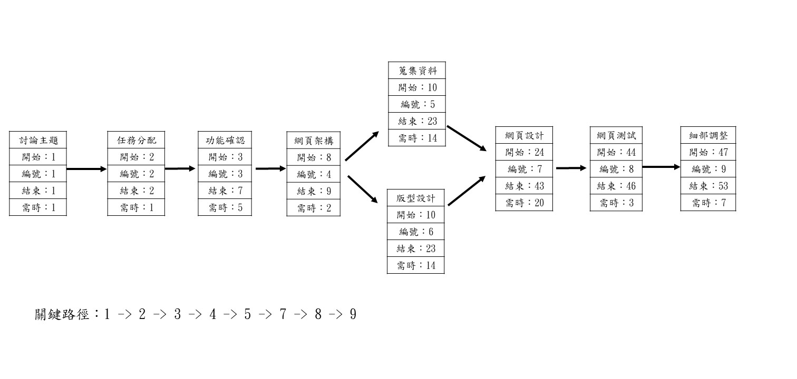
## 甘特圖:
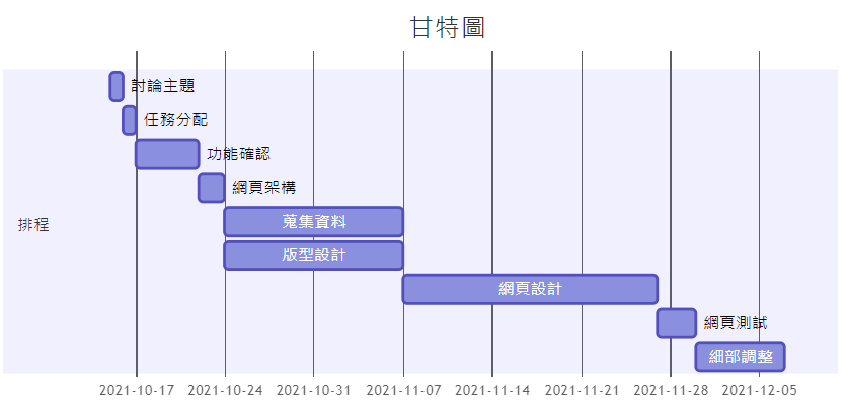

## 功能性:
圖片顯示

資訊顯示

可搜尋
## 非功能性:
可維護性

可擴充性

使用性
## 功能分解圖:
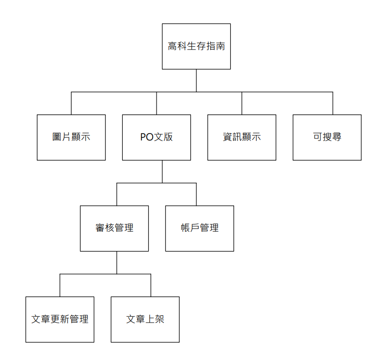
## 需求分析:
1、用戶可以透過"po文版"投稿文章。

2、管理者可以審核會員的投稿文章。

3、用戶可透過"搜尋關鍵字"尋找相館資訊。

4、用戶也可以透過"食、衣、住、行...的頁籤" 尋找相關資訊。

5、用戶可以點擊圖片可顯示圖片的位置、資訊。

## 使用案例圖:
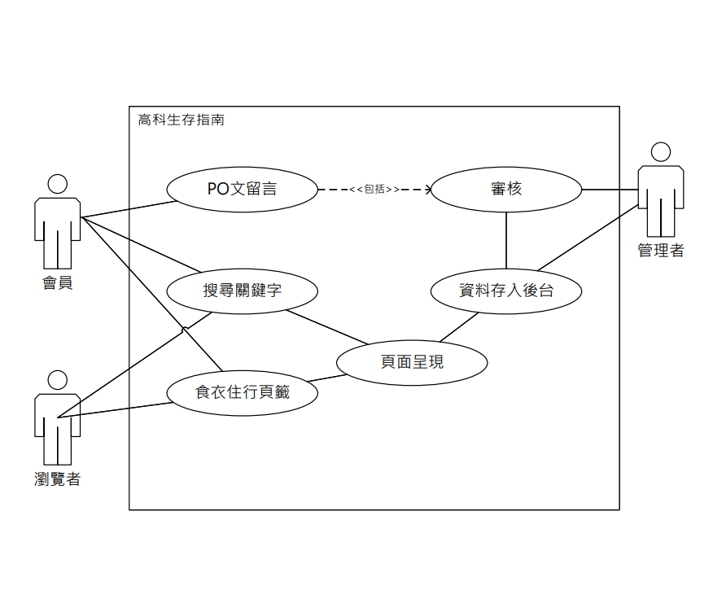

## 使用案例說名:
 | 使用案例名稱 |圖片、資訊顯示|
 |:-|:-|
 |行動者|瀏覽者|
 |說明|呈現使用者欲瀏覽的資訊圖片|
 |完成動作|多張圖片會自行滑動，且會呈現圖示進行選取動作來顯示資訊|
 |替代方法|無|
 |先決條件|使用者至少需要使用chrome瀏覽器|
 
   | 使用案例名稱 |PO文版|
 |:-|:-|
 |行動者|瀏覽者|
 |說明|使用者輸入欲分享的資訊|
 |完成動作|使用者提供的資訊在審核過後會投稿至相關主題之頁面|
 |替代方法|無|
 |先決條件|需註冊帳號，並進行登入|
 
  | 使用案例名稱 |可搜尋|
 |:-|:-|
 |行動者|瀏覽者|
 |說明|輸入關鍵字即搜尋相關資訊|
 |完成動作|呈現使用者欲查詢的資訊|
 |替代方法|無|
 |先決條件|使用者至少需要使用chrome瀏覽器|
 

## 系統環境圖(DFD)
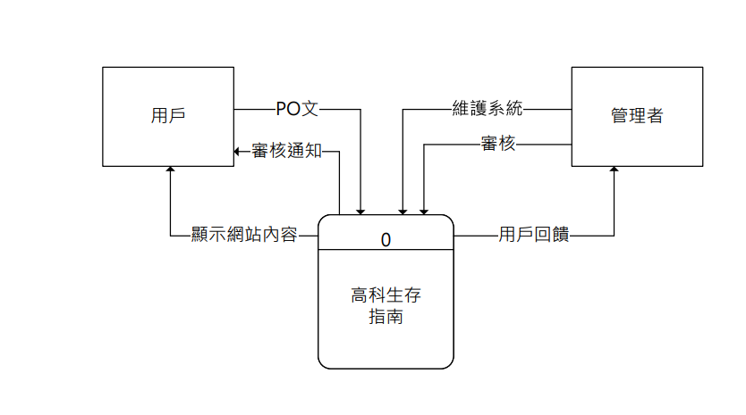

## DFD圖0程序
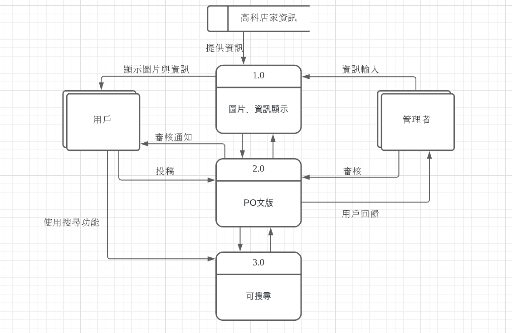

## 循序圖
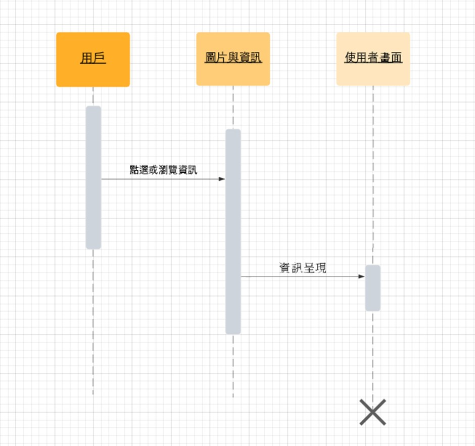
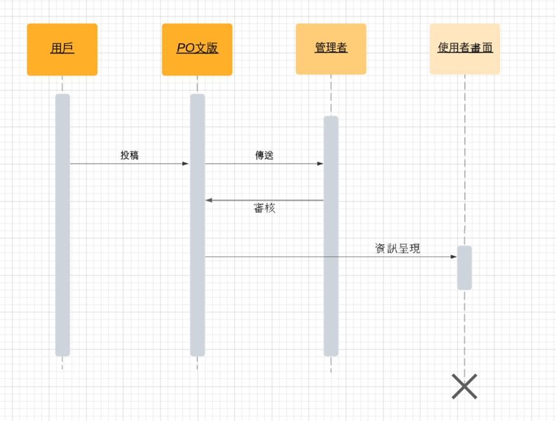
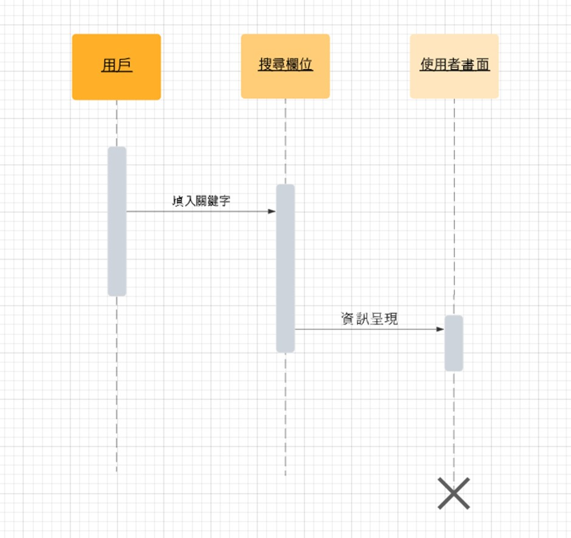

## 活動圖
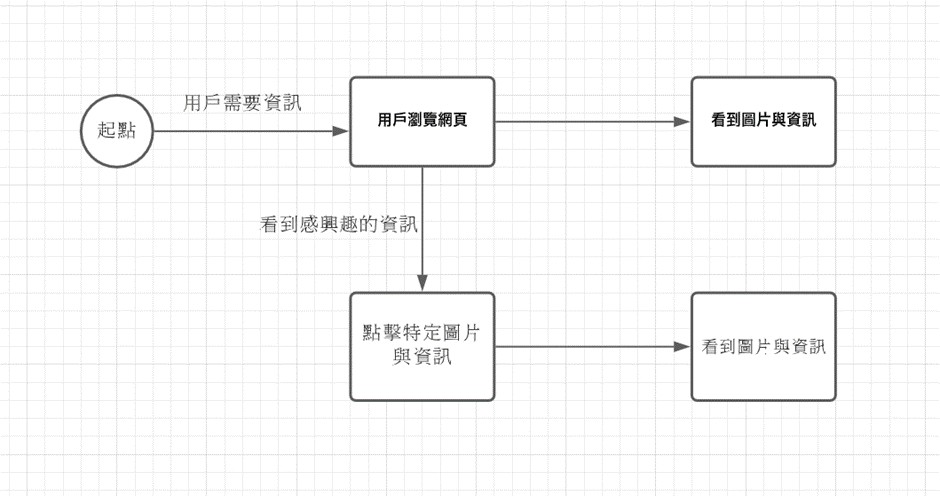
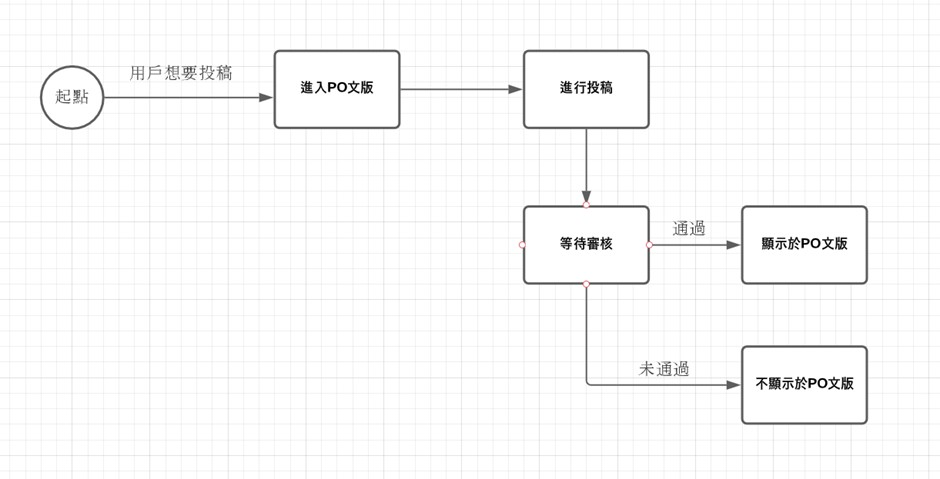

